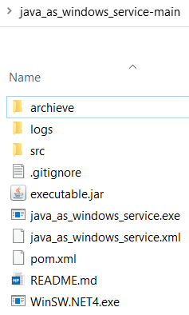
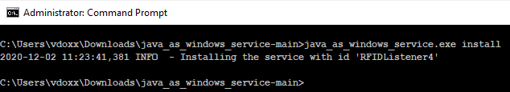
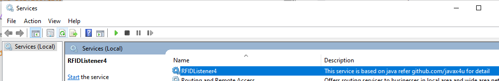

## Tutorial For Java File As Windows Service

**[YouTube video link](https://www.youtube.com/watch?v=_InhQ4Gu7PQ)**

### Step-01: Create a sample java project in netbeans with maven or download it from [github project](https://github.com/javax4u/java_as_windows_service.git)

github download link https://codeload.github.com/javax4u/java_as_windows_service/zip/main



### Step-02:Edit pom.xml to generate executable jar file.

```xml
<build>
	<finalName>executable</finalName>
	<plugins>
        <!-- Make this jar executable -->
        <plugin>
            <groupId>org.apache.maven.plugins</groupId>
            <artifactId>maven-jar-plugin</artifactId>
            <configuration>
                <!-- DO NOT include log4j.properties file in your Jar -->
                <excludes>
                    <exclude>**/log4j.properties</exclude>
                </excludes>
                <archive>
                    <manifest>
                        <!-- Jar file entry point -->
                        <mainClass>ServiceClass</mainClass>
                    </manifest>
                </archive>
            </configuration>
        </plugin>
    </plugins>
<build>
```
### Step-03:[Download winsw.exe and config.xml](https://github.com/winsw/winsw/releases/tag/v2.10.3) and make below changes
 
Rename sample-minimal.xml as java_as_windows_service.xml

Rename WinSW.NET4.exe as java_as_windows_service.exe

Update  java path in   java_as_windows_service.xml 
	
	<executable>C:\Program Files\Java\jdk1.8.0_101\bin\java</executable>

E:\Customer-large-file-size\java_as_windows_service install

### Step-04:Install service and check logs.

E:\Customer-large-file-size\java_as_windows_service>java_as_windows_service.exe install




## Section-FAQ

### What changes are required in pom.xml ?
You will need to compile your app as executable jar. Follow steps-02


### Log file should be new on each day or rolling mode of log file should be date.
```xml
<service>
  <id>java_as_windows_service</id>
  <name>java_as_windows_service_name</name>
  <description>This service is based on java</description>
  <executable>C:\Program Files\Java\jdk1.8.0_201\bin\java</executable>
  <arguments>-jar target/executable.jar</arguments>
  <logpath>%BASE%\logs</logpath>
  <!--<logmode>rotate</logmode>-->
<!-- below line will create new files each day -->
  <log mode="roll-by-time">
	  <pattern>yyyyMMdd</pattern>
  </log>
</service>
```
p.s For rotation of log based on size use this link 

### What command will be used to install as windows service ?
E:\Customer-large-file-size\java_as_windows_service>java_as_windows_service.exe install


## video link
[](https://www.youtube.com/watch?v=_InhQ4Gu7PQ "java as a window services")